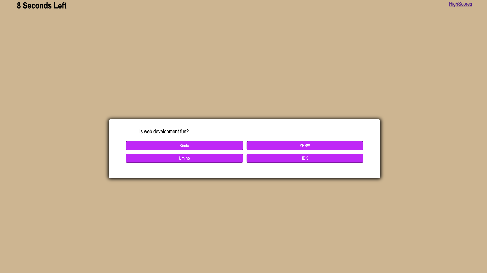

**#Coding quiz**

**## Objective:**

**## To successfuly make a quiz that presents questions to the player and adds time when the question is correct but also subtracts time when it is incorrect. It also allows the user to save an input to the a highscores page if the complete the quiz** 

**## (picture)**

**# URL to page**

["link to website"](https://kay0ss.github.io/Code-Quiz/)